# Советы по самостоятельному поиску материалов и информации для самообучения

## Предисловие
В тематических каналах, чатах, форумах по IT часто спрашивают какой материал подобрать, чтобы
научиться программировать и задают однотипные вопросы, плохо перед этим поискав информацию об этом. Такая же ситуация 
с вопросами о типовых проблемах при решении задач или написании проектов.

Этот документ написан с целью дать рекомендации и показать способы **самостоятельного поиска информации с примерами**
по IT/Computer Science тематике ~~а то почему оно на гитхабе~~. Также их можно адаптировать под другие направления.

**В наличии будут мемы, чтобы писанина выглядела интереснее; я люблю смешные картинки, в них есть доля правды и...
Нецензурные выражения, а также ни к чему не призываю и не несу цели оскорбить такими изображениями!**

Что здесь **не будет**:
* способов поиска нелицензионных, пиратских материалов. Если научитесь использовать поиск, 
то самостоятельно с этим справитесь. **Автор не хочет нести ответственность
за нарушение авторских прав!**
* Методики обучения. Если вы не владеете навыками **самостоятельного обучения** или присутствуют негативные 
психические процессы, которые этому мешают, решите эти вопросы для повышения эффективности работы с источниками.
* Учебных планов, дорожных карт по интересующей вас технологии.


* Если есть чем дополнить, что добавить, исправить, улучшить - в `pull request` или `issue`
* Если нашли ошибки, недочёты или какой-либо вопрос не полностью раскрыл - в `pull request` или `issue`
* Если будете применять информацию из этого документа - просьба указать автора и ссылку на первоисточник!

# TL DR
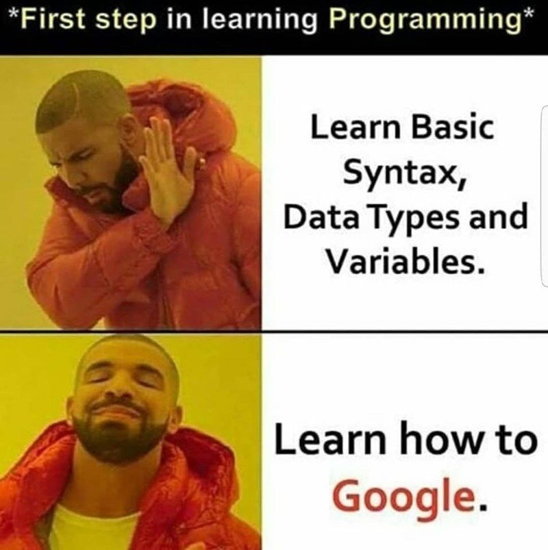

### Оглавление
0. [Курсы](#Курсы)
1. [Английский](#Английский)
   1. [Машинный перевод](#Машинный-перевод)
   2. [Зачем его знать](#Зачем-его-знать)
   3. [Минимальные компетенции](#Минимальные-компетенции)
2. [Выбор литературы. Как самостоятельно обучаться](#Выбор-литературы.-Как-самостоятельно-обучаться)
3. [Как гуглить](#Как-гуглить)
   1. [Какой поисковик использовать](#Какой-поисковик-использовать)
   2. [Простой поиск](#Простой-поиск)
   3. [Синтаксис](#Синтаксис)
   4. [Продвинутый поиск](#Продвинутый-поиск)
   5. [Не получается нагуглить](#Не-получается-нагуглить)
4. [Официальные источники](#Официальные-источники)
5. [Youtube](#Youtube)
6. [Stackoverflow. Stack Exchange Network](#Stackoverflow.-Stack-Exchange-Network)
7. [Github](#Github)
   1. [Поиск, полезные репозитории](#Поиск,-полезные-репозитории)
   2. [issue](#issue)
   3. [Обучение на исходных кодах](#Обучение-на-исходных-кодах)
8. [Соцсети, чаты Open Source проектов. Как задавать вопросы](#Соцсети,-чаты-Open-Source-проектов.-Как-задавать-вопросы)
   1. [Как задавать вопросы](#Как-задавать-вопросы)
9. [Шаги поиска информации](#Шаги-поиска-информации)
   1. [Поиск решения проблем](#Поиск-решения-проблем)
   2. [Поиск материалов для освоения или улучшения знаний для новой технологии](#Поиск-материалов-для-освоения-или-улучшения-знаний-для-новой-технологии)


## Курсы.
### Курс <...> хороший? Стоит его покупать, проходить?

Мое личное оценочное мнение, что __платные__ курсы на **базовый уровень** не нужны из-за обилия бесплатных 
учебных материалов. Как легально бесплатных и не очень. 

Если вы не согласны с этим утверждением и всё равно хотите купить, держите список нюансов.
Покупать или нет дело ваше, моя цель не отговорить от покупки. *Ниже пункты не относятся к бесплатным курсам.*

1. Площадки по курсам не ставят цели сделать из вас крутого, востребованного специалиста~~-Гигачада~~. 
Это бизнес, ничего личного.

2. Гарантированное трудоустройство с хорошей ЗП ~~300к наносек~~ после прохождения курса сильное заявление. 
Зайдите на [hh.ru](https://hh.ru) или [career.habr.com](https://career.habr.com), 
чтобы посмотреть актуальные направления, требуемые компетенции и ЗП.

3. Успешных учеников после прохождения курса крайне мало. Мое мнение, что на бесплатных материалах аналогично 
смогли бы хорошо обучаться.

4. Если окажется, что вам не нравится то, чем занимаетесь, то вас не будут как в средне образовательной школе 
насильно заставлять учиться. 

5. Подумайте хорошо перед тем, как покупать платный курс (а то и брать кредит!). 
Попробуйте бесплатные альтернативы (будут ниже приведены способы как их найти).

Преимущества перед бесплатными курсами есть, их немного:

* Будет в наличии опытный наставник (ментор), которому можно задавать вопросы, спрашивать, если что-то не поняли. 
И это если курс подразумевает такое, возможно, будут просто видео с преподавателем, где он будет рассказывать материалы уроков.
* Готовая программа обучения: можно пропустить этап поиска и сбора материалов для обучения.
* **Возможно** будет мотивация и ответственность не выкинуть деньги на ветер и прилежно обучаться по заданной программе. 
"Возможно" приписка здесь не просто так, это не точно!

Продублирую ещё раз, эти предостережения относится **к азам, базовым материалам**. Если вы знаете базу, а хотите 
узконаправленную, сложную тему изучить с помощью платных курсов, то здесь сложнее: надо оценивать качество 
программы курса, преподавателей/менторов, кто будет сопровождать и уникальность. 

Оценка пригодности таких курсов не входит в цели этого документа, документ про поиск и сбор преимущественно бесплатной, 
открытой информации для самообучения. Это прейдет с опытом.


## Английский
Этот раздел ответит на вопросы почему машинный перевод не очень эффективен и какие компетенции нужны
для понимания материалов на этом языке. Также, большинство приведенных ниже источников будут на английском.

### Машинный перевод
Этот раздел не призыв полностью отказаться от машинного перевода, а только указывает проблемы такого
подхода.

**Полный авто перевод** страницы зачастую искажает контекст и смысл информации (особенно в документациях, технической,
научной литературе), потому что используются профессионализмы, термины, сокращения, которые зачастую применяют 
в речи как англицизмы. Как в молодежном сленге: "кринж", "краш", ~~симпл димпл попит тикток~~.

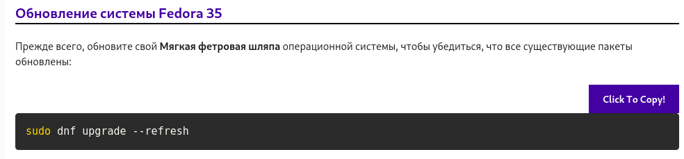

Например:
```
bug - ("баг") дословно жук, означает проблему в программно-аппаратном решении
feature - ("фича") дословно особенность, означает какую-либо особенность в программно-аппаратном решении
```
[Больше примеров таких жаргонов-англицизмов](prog_words.md)

Если лениво или сроки сжаты, то лучше переводите небольшими блоками или предложениями для минимального
искажения контекста. 

Или если совсем незнакомый язык, который не знаете - переводите: китайский, испанский, простой межгалактический и прочие
непонятные с перспективой искажения смысла.

### Зачем его знать
Зачем знать английский, если не поеду жить в Лондон или Вашингтон?


В наше время это самый распространенный язык в мире, и он официально используется в ~50 стран.
В интернете на нём больше всего контента, материалов и информации, особенно он мейнстрим по IT.

Базовые, поверхностные материалы вы найдете на русском и они подойдут для начала, 
но переводы более сложных узконаправленных технологии устаревают на 4 и более лет и лучше обращаться к оригиналам. 
А оригиналы на английском ~~из-за Обэмы и мирового заговора~~!

По этим причинам подавляющее число актуальных материалов пишут на этом языке, и он необходим 
для расширения числа полезных источников.

### Минимальные компетенции


Причины выше могут напугать, но не расстраивайтесь! 
В технической IT литературе довольно ограниченный запас слов требуется знать (около 200-300 максимум).
Если ваша цель не будет общаться на этом языке, полностью
переводить текста, в совершенстве знать грамматику и читать художественную литературу с философскими трудами в 
оригинале, то следующих компетенций хватит для чтения *"по диагонали"* и понимания технической литературы,
документаций и статей на английском по IT.

* Базовые формы времени глаголов по типу: Present Simple, Present Continuous, Past Simple, Future Simple  
* Знание перевода самых распространенных глаголов (в том числе неправильные формы в прошедшем и будущем),
существительных, местоимений, предлогов.
* Профессиональные термины в вашей отрасли, пример таких самых распространённых для IT/Computer Since:
[Словарь распространенных терминов в IT/Computer Since](dictonary_base.md)

Возможно их не хватит, но вы доберете словарный запас по ходу дела!

Обращайтесь к английским источникам для подкрепления знаний на практике, мало просто его знать.


## Выбор литературы. Как самостоятельно обучаться
Какую книгу выбрать? Я нашел книгу **"A"**, она нормальная?

Этот раздел будет краток, поэтому прикладываю ссылки на брошюру профессора Поварнина С.И: "Как читать книги" с вырезкой
одного раздела.

**Не пугаемся, что её в 20 веке написали**, советы, рекомендации как читать и выбирать оттуда стали ещё более 
актуальны из-за изобилия количества информации.

```
...
В. О выборе книг для самообразования:
17. Читай хотя бы немного, но основательно.
18. Читай необходимое, хотя бы неинтересное.
19. Читай самое лучшее, что можно достать.
20. Читай не слишком легкое, не слишком трудное.
21. Руководись каким-нибудь планом чтения (по программам или совету специалиста).
```

Google поиск: [Поварнин С.И как читать книги](https://www.google.com/search?q='Поварнин+С.И+как+читать+книги')

Google, фильтр на pdf файлы: [Поварнин С.И как читать книги](https://www.google.com/search?q='filetype:pdf+Поварнин+С.И+как+читать+книги')

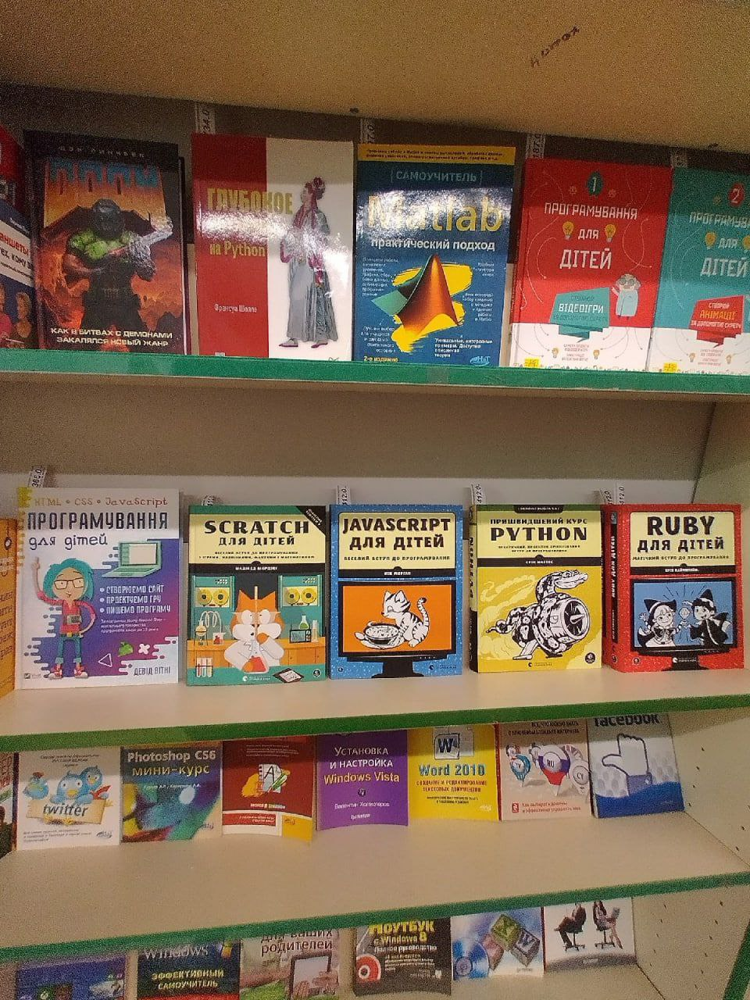

## Как гуглить
Статей много на эту тему, поэтому здесь будут примеры, личные рекомендации по улучшению 
эффективности поиска и демонстрация.

### Какой поисковик использовать
В распространенных случаях, хватает самых популярных поисковых систем, но также используйте и другие, 
если результаты не выдали что нужно. Ищите не только русскоязычные источники, ищите **ВСЁ**.

* https://google.com/
* https://ya.ru/
* https://duckduckgo.com/
* https://www.bing.com/

Не забываем настроить поисковую систему, если это возможно

* https://www.google.com/preferences
* https://yandex.ru/tune/search

Существуют и узкоспециализированные поисковики, используем по надобности
* https://wiby.me/ - поисковик по древним сайтам
* https://refseek.com/ - поиск по академическим ресурсам
* https://worldcat.org/ - поиск по мировым библиотекам
* https://searchcode.com/ - поиск по исходным кодам
* ...

Их тысячи, поищите самостоятельно!

### Простой поиск
В большинстве случаев хватает простого запроса без применения специального синтаксиса. Забыли как что-то реализовать - 
пишем в поиск, что хотим сделать. Программа выкинула ошибку - копируем *Traceback*, в поиск и ищем ответы!


Примеры:

Столкнулись в python с ошибкой деления на `0`
```python
y = 1/0
# Traceback (most recent call last):
#   File "<stdin>", line 1, in <module>
# ZeroDivisionError: division by zero
```

В поиск вводим `ZeroDivisionError: division by zero`

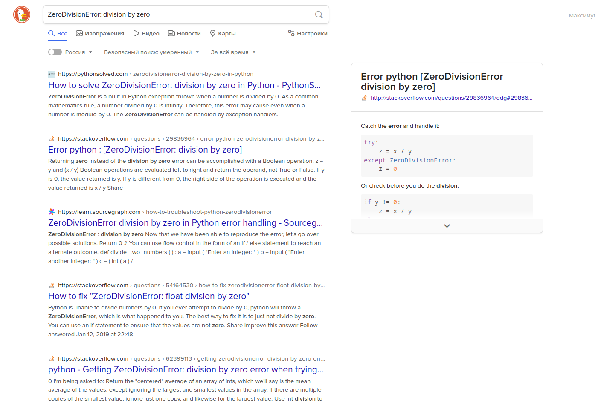

Забыли, как сортировать в javascript элементы в массиве

`javascript list sort`

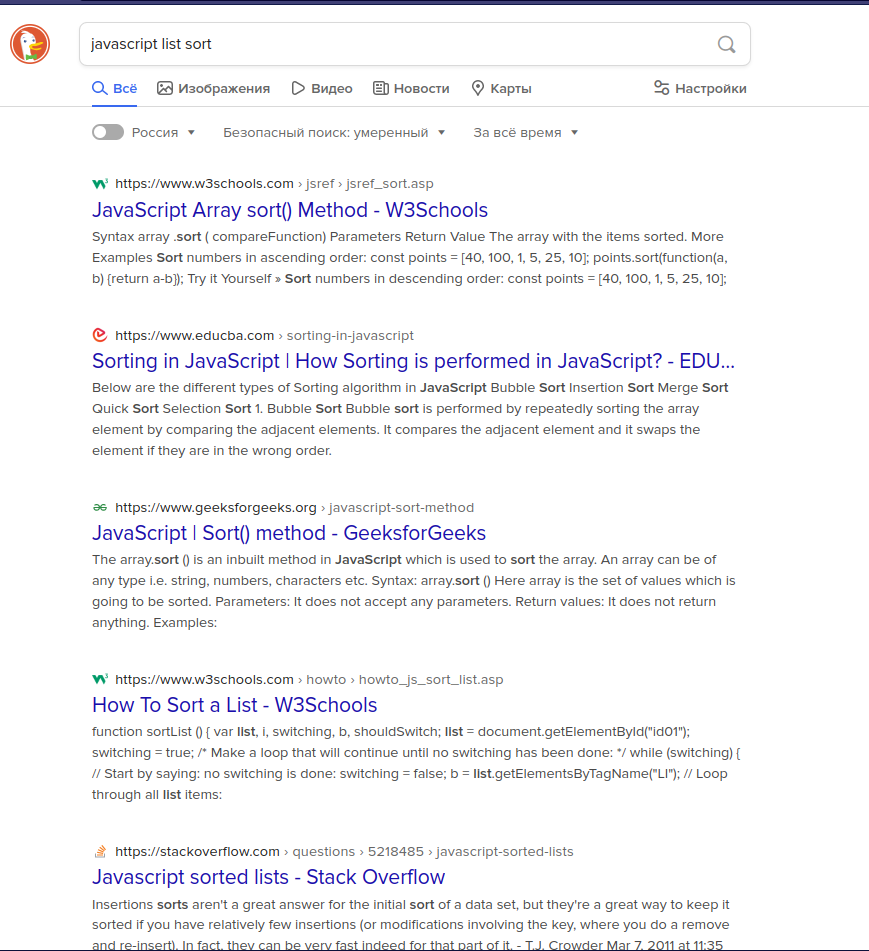

### Синтаксис
Минимальный список поискового синтаксиса:

| Cинтаксис      | Описание                | Пример          |       
| -------------- | ----------------------- | --------------- | 
| "query"        | поиск по слову          | "github"        |
| -query         | исключить слово         | -github         |
| inurl:query    | поиск по слову в ссылке | inurl:ru        |
| site:query     | поиск по сайту          | site:github.com |
| filetype:query | поиск по типу файла     | filetype:pdf    |
| lang:query     | поиск по языку          | lang:ru         |

Конструкций ещё больше, дополнительно информацию ищите через запрос `google search operators` 
или `google search cheat sheet`

### Продвинутый поиск

Большинство примеров будут высосаны из пальца, поэтому тут будет треш и угар в большинстве кейсах. Цель раздела 
- демонстрация работы поиска.

Поиск книжки по delphi 7 ~~который по сень день дают в школах~~, пишем:

`filetype:pdf "Delphi 7"`

 

Хотим на украинском языке книжку? Легко!

`lang:"uk" filetype:pdf "Delphi 7"`


Репозитории **только на github** с упоминанием django:

`site:github.com django`


Поиск презентаций или докладов по django, но не школьный доклад по информатике или музыка. 
Если будут лишняя выдача попадаться, отсекайте `-` оператором

`django презентация|доклад -информатика -музыка`


Статьи на хабре по django, без вакансий, основного хаба

`site:habr.com django -inurl:career -inurl:hub inurl:post`


Поиск по **.рф** доменной зоне django

`django inurl:рф`

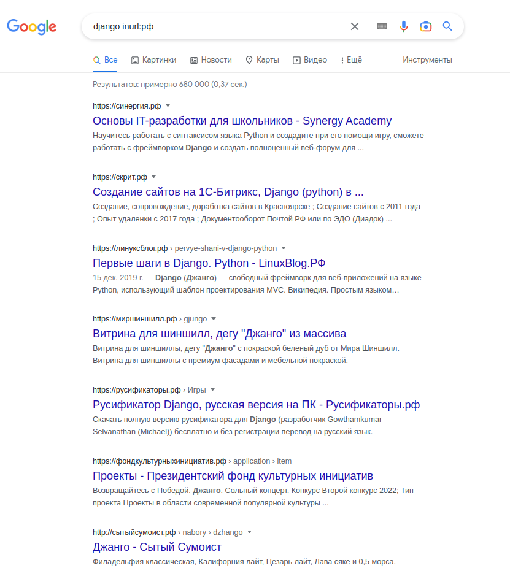

Также, в google можно указать период поиска по дате, будет эффективно, если пытаетесь найти самые актуальные или
устаревшие материалы ~~или чтобы накопать древних баянов~~

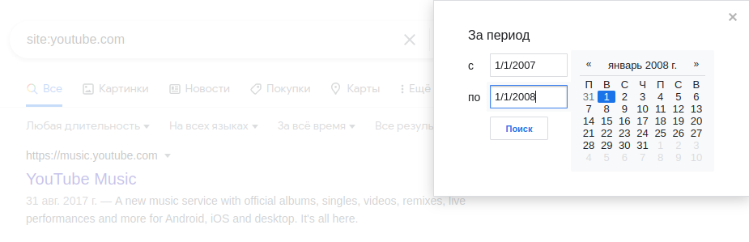


### Не получается нагуглить

Если не получается найти ответы, разбейте работу программы на шаги, подзадачи. С какой возникли
 трудности - разбираем, ищем дополнительную информацию.

1. Декомпозируйте задачу на более мелкие подзадачи
2. Гуглите подзадачу, которая не понятна
3. Если на подзадачу не получается найти ответы - декомпозируем, повторяем шаги 2-3. 

Например, если вы хотите написать программу скачивания файлов (есть готовые решения, для примера наличие игнорируем), 
разбиваем на подзадачи:

1. Отправка http запроса на ссылку с ввода
2. Скачивание файла
3. Запись файла на диск

Не ясен шаг 2 и 3, не знаем как делать? Окееей, дробим!

1. Отправка http запроса на ссылку с ввода
2. прочитать файл с сервера
3. скопировать байты файла с сервера в переменную
4. создать файл
5. открыть файл в режим записи
6. записать байты в файл
7. сохранить
8. закрыть файл

Более житейский пример декомпозиции задачи:

Хотим сделать бутерброд и съесть:

1. отрезать кусок от хлеба
2. положить на хлеб произвольную начинку (сыр, колбаса, мясо соус etc)
3. съесть


## Официальные источники
У большинства популярных языков программирования, фреймворков есть официальный сайт с примерами, 
туториалами и документацией. Перед поиском дополнительных источников, загляните туда сначала.

Примеры:
* https://www.javascript.com/learn
* https://dev.java/learn/getting-started-with-java/
* https://www.rust-lang.org/learn
* https://docs.python.org/3/tutorial/index.html

Преимущества:
* Актуальная информация
* Самый базовый материал и уроки, как правило, описаны хорошо 

Недостатки:
* Возможно её отсутствие, неполнота 😱
* Оформление и стиль изложения может "оставлять желание лучшего"
* Продвинутый функционал, методы зачастую расписаны сухо и "для протокола"


## Youtube
Youtube - хранилище не только для политоты, летсплеев и всяких глупостей, там также есть полезные, обучающие 
видеоматериалы. 

В этом разделе покажу, как с помощью фильтра "плейлист" быстро достать набор видеозаписей.


Шаги действий:
1. В поиск вбиваем ЯП/Фреймвок/Технологию и прочую интересующую нас тему
2. Ставим фильтр на "Плейлист"

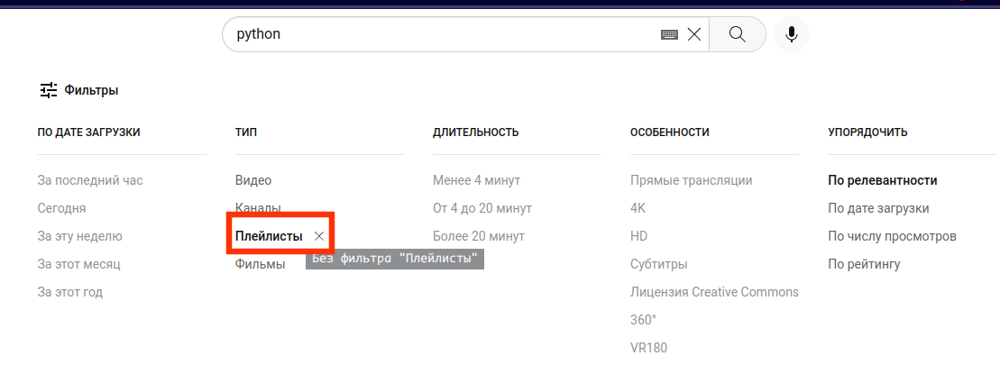

Примеры:
* `python` https://www.youtube.com/results?search_query=python&sp=EgIQAw%253D%253D
* `python 2.7` https://www.youtube.com/results?search_query=python+2.7&sp=EgIQAw%253D%253D
* `golang` https://www.youtube.com/results?search_query=golang&sp=EgIQAw%253D%253D
* `c++` https://www.youtube.com/results?search_query=c%2B%2B&sp=EgIQAw%253D%253D
* `asm language` https://www.youtube.com/results?search_query=asm+language&sp=EgIQAw%253D%253D
* `cobol` https://www.youtube.com/results?search_query=cobol&sp=EgIQAw%253D%253D

**Экспериментируйте уточнять запрос, чтобы конкретизировать тему**
* `python pytest` https://www.youtube.com/results?search_query=python+pytest&sp=EgIQAw%253D%253D
* `javascript react` https://www.youtube.com/results?search_query=javascript+react&sp=EgIQAw%253D%253D
* `linux devops` https://www.youtube.com/results?search_query=linux+devops&sp=EgIQAw%253D%253D

Примечания, полезности:
* Если вам необходимо найти более короткий материал для поверхностного обзора и посмотерть как оно работает, 
используйте обычный поиск видео
* Создайте отдельный канал для просмотра таких видео и подписок на тематические каналы, чтобы в рекомендациях предлагали 
всякое интересное. И смотрите только по IT/Computer Since теме, для других тематик заведите отдельный канал. 
* Смотрите на дату выхода.
* Ютуб отключил дизлайки, заглядывайте в комментарии за дополнительной информацией, уточнениями и быстрой
оценкой качества материала!
* Включайте субтитры, если с пониманием иностранного языка на слух не очень.
* По совсем узкоспециализированным темам возможно не выйдет найти через плейлисты.
* Ютуб поиск скуден на фильтры если искать по дате, используйте гугл запрос с фильтром по дате:
`site:youtube.com inurl:watch?v= запрос`


## Stackoverflow. Stack Exchange Network

Stack Overflow — система вопросов и ответов о программировании. Полезный ресурс, если не получатся через поисковики найти
решение проблемы.


Если вы не можете найти ответ на вопрос или он отсутствует, то сначала ознакомьтесь с инструкциями ниже перед тем как
задавать.

* [Как задавать вопросы](https://stackoverflow.com/help/on-topic)
* [non-programming вопросы](https://stackexchange.com/sites#technology)

Также, существует русскоязычная версия [ru.stackoverflow.com](https://ru.stackoverflow.com), но рекомендуется 
использовать англоязычный, так как там больше аудитория и соответственно быстрее найдете и получите ответ. 


## Github

Этот не только файлопомойка для вашего кода ~~и сайт знакомств для фембоев~~, 
здесь есть полезные репозитории, теги для поиска и просто крутые проекты.


Чтение и изучение исходного кода хорошая практика, так как видео, статьи или книги могут не дать нужных приемов,
навыков разработки.

### Поиск, полезные репозитории

* https://github.com/TheAlgorithms - Наборы алгоритмов по распространенным ЯП
* https://github.com/sindresorhus/awesome - Наборы различных полезностей
* https://github.com/search?q=cheat+sheet - Различные шпаргалки

Некоторый список полезных тегов для поиска
* https://github.com/topics/educational - обучение
* https://github.com/topics/learn-to-code - обучение
* https://github.com/topics/interview-questions - вопросы интервью
* https://github.com/topics/cheet-sheet - полезные шпаргалки
* https://github.com/topics/awesome-list - список полезностей
* https://github.com/topics/oop - ООП

Также, можно вбить в поиск `algorithm` `learn` или другое интересующие темы, отфильтровать по количеству звёзд или 
обновлениями и найти проекты.

### issue

Если поисковик не помог решить проблему в библиотеке/фреймворке, то зайдите в **issue** раздел.
Если вы не нашли ответ на вопрос, то можете напрямую задать разработчикам данного решения. **Не забывайте соблюдать
рекомендации и шаблоны по написанию issue**, про это будет ниже.

**Примеры:**

В python есть популярная библиотека для http запросов [requests](https://github.com/psf/requests).
Есть проблема, что нет функциональности в объекте `Session` выставить таймаут по умолчанию.
Находим [issues/3070](https://github.com/psf/requests/issues/3070)

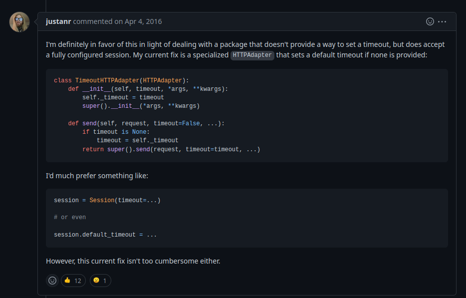

Вопрос по работе с [fastapi](https://github.com/tiangolo/fastapi) фреймворком, 
как пробрасывать соединение через gunicorn без применения прокси сервера nginx 
[issues/5449](https://github.com/tiangolo/fastapi/issues/5449)

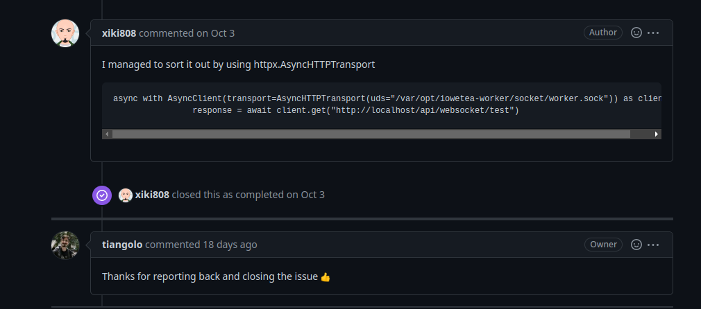

### Обучение на исходных кодах

Этот раздел больше подойдет для тех, у кого базовые знания есть,  но хочет ещё подчеркнуть 
на практике интересные техники, реализации, опыт разработки, как писать не надо или научиться читать чужой код.


Полезно также для разбора практических решений, где применяют паттерны ООП.


Кроме прямого скачивания и изучения кода, смотрите commit'ы для отслеживания развития проекта и мыслей автора:

1. Найти интересующий вас проект. ~~Популярный, успешный проект сына маминой подруги гигачада~~
2. Клонировать к себе.
3. Открыть редактор кода или другой инструмент для более удобного отслеживания изменений. 
На скриншоте Jetbrains IDE.
4. Листаем в самый низ, или до интересующей метки.
5. Смотрим, изучаем, анализируем реализацию кода, стиль сообщений commit. 
И делаем выводы. ~~Что ничего не понял, но очень интересно~~ 
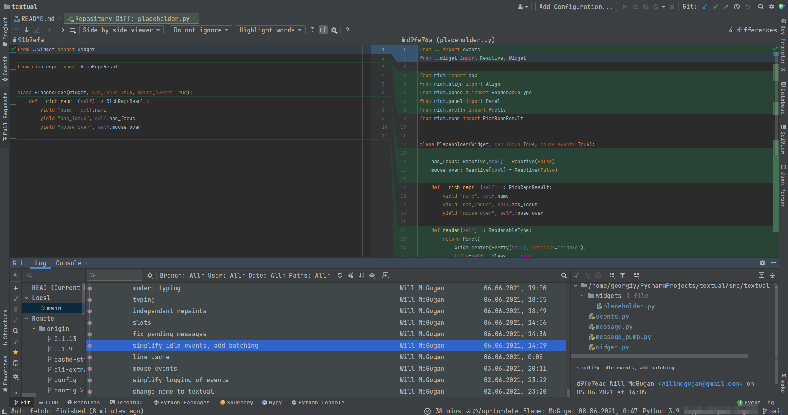

## Соцсети, чаты Open Source проектов. Как задавать вопросы

У некоторых библиотек/фреймворков есть контакты для связи, форумы, чаты в мессенджерах, соцсетях и прочих сайты для
социализации и общения: от vk, telegram, discord, reddit до древнего IRC

### Как задавать вопросы
Если это enterprise платный продукт - там есть в штате на зарплате техническая поддержка, это их обязанность помочь,
в отличие от open source решений.


Open source зачастую развиваются бесплатно и на энтузиазме, поэтому для получения ответов 
задавайте вопросы по делу. Вас много (в зависимости от популярности проекта), всем помочь и одно и тоже 
отвечать морально тяжело. Это не stackoverflow, попробуйте изучить самостоятельно проблему перед тем, как писать, 
уважайте их труд!

Если будете игнорировать рекомендации ниже в лучшем случае направят использовать поисковик или проигнорируют.
В худшем, могут быть недопонимания, и диалог может перейти на маты с оскорблениями с последующей блокировкой в чате.


* **Убедиться, что вопрос связан с используемым ЯП и целевой библиотекой/фреймворком.**

Участники вправе не отвечать по вопросам как работать с другими библиотеками, ЯП, 
технологиями не связанными с тематической.
```
Maybe... ok:
Посоветуйте дешевый хостинг
я пишу решение на вашем фреймворке, посоветуйте ORM для управления базами данных 
BAD:
как открыть файл через <библиотку А> и прочитать/записать
как пропатчить KDE2 под freebsd
``` 
* Вы читали документацию, FAQ, искали, гуглили, смотрели issue, поискали в самом чате/форуме упоминания и изучили проблему.


* Вы владеете достаточными компетенциями по схожим технологиям, ЯП. Эти чаты не ученическая/студенческая конференция, 
в которой цель - научиться программировать. Если отсутствую хотя бы базовые знания, то извольте научиться. 
```
OK:
у меня проблема по работе с фреймворком <описание>, пример <кода>, что делаю не так
BAD:
как установить компилятор/интерпретатор, настроить среду разработки
как делать сравнения, складывать числа, писать циклы...
как написать функцию и возвращать значение из неё
```
* Никаких [метавопросов](https://nometa.xyz/ru). Задавайте сразу, по делу, с подробностями в одно сообщение. 
Это всем сэкономит время, нервы и дадут лучше ответ, что делать.


Если это баг или ошибка, то прикладывайте **подробно** информацию: на какой OS случилась проблема, 
какая версия компилятора/интерпретатора, версия библиотеки/фреймворка и опционально дополнительные данные, 
если отсутствуют шаблоны тикетов issue с рекомендациями, что писать.

```
BAD:
Q [12:32] Привет
Q [12:32] Помогите
Q [13:00] Есть кто?
A [13:02] ????
Q [13:10] У меня ошибка SSL: CERTIFICATE_VERIFY_FAILED
A [13:15] Какая у тебя OS, скинь пример кода
Q [13:30] MacOS, <code example>
A [13:35] Импортируй сертефикаты https://stackoverflow.com/questions/42098126/mac-osx-python-ssl-sslerror-ssl-certificate-verify-failed-certificate-verify
BAD:
Q [17:55] ребят, словил лютую ошибку
Q [17:55] можете помочь ?
Q [17:55] не могу найти в инете решение проблемы)
OK:
Q [12:32] Всем привет, у меня ошибка SSL: CERTIFICATE_VERIFY_FAILED, <пример кода>, система MacOS
A [13:02] Импортируй сертефикаты https://stackoverflow.com/questions/42098126/mac-osx-python-ssl-sslerror-ssl-certificate-verify-failed-certificate-verify

OK: 
Q: Вы не написали почему ваша библиотека не поддерживает версию <...>. Можете объяснить почуму надо ставить минимум версию <...>
```
* Проявлять нежелание разбираться с проблемами, призывать это делать других. 

За вас бесплатно не будут исправлять код, дословно пояснять, разжёвывать.
Но вам будут скидывать короткие примеры кода или скинут источники (в зависимости от токсичности обитателей таких мест, 
мы живем не в идеальном мире), где можно изучить этот вопрос. 
Учитесь работать с источниками, пробуйте решать проблему самостоятельно! Здесь не любят людей, которых не хотят сами
пытаться разобраться, а спихивают это на других.

**Если реально не хотите этим заниматься, то может быть на аутсорс делегируете задачу за денежную оплату, 
чтобы за вас сделали?**

```
OK
Q Всем привет! Хочу с помощью вашего решения сделать такую <функциональность> <пример кода>. Я пробовал <solution_1> 
<solution_2>...<solution_n> У меня не получается, подскажите что делаю не так? 
Пишу на linux, интерпритатор версии <версия>

BAD
Q Не проходит пятый тест из за этого слова как исправить? <code>
A У тебя проблемы в этой части кода, поправь.
Q Как это исправить?
A <приложение материала с пояснениями для разбора пробелов и недопониманий>
Q Мне что делать больше нефиг?
```

* Респектуйте, относитесь с уважением к тем, кто помогает, консультирует и поддерживает это open source решение!


Такие требования могут напугать потенциальных читателей этого документа, чтобы вообще не задавали вопросы, но, 
вкратце, проявляйте уважение, заинтересованность, что реально пытаетесь и хотите решить проблему, 
тогда неравнодушные люди отнесутся с пониманием и помогут. А помогут или нет, зависит от токсичности сообщества, к кому
приходите с такими вопросами.

## Шаги поиска информации
Привожу примерные шаги действий для решения задач.

Примечание: Если тема **не узконаправленная** — ищите русскоязычные источники. 
**Если ничего не нашли на русском, — не боимся брать англоязычные источники.** 

### Поиск решения проблем
1. Отладка, debug
2. Google
3. Stackoverflow
4. Документация, FAQ проекта (если есть)
5. github
6. github - issue
7. Ничего нет? Пишем issue или в их контакты с вопросами или проблемами.
8. Неуспех? Пробуем самостоятельно решить, разобраться.

### Поиск материалов для освоения или улучшения знаний для новой технологии
1. Официальная документация, примеры
2. Google
3. Поиск видео, статей (для быстрого обзора, информация будет поверхностной)
4. Плейлисты (если есть актуальные)
5. Поиск литературы
6. Поиск готовых проектов на github с применением интересующей технологией

# Удачного самообучения!


